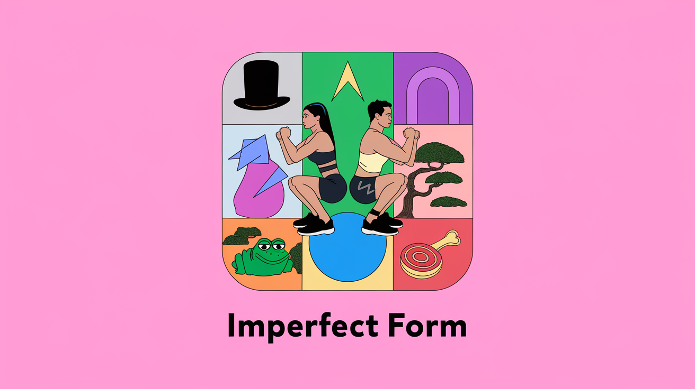

# Imperfect Form - Farcaster Mini App

A retro-gamified fitness companion application built as a Farcaster Mini App. This sister app to [imperfectform.fun](https://imperfectform.fun) creates collective goals, leaderboards, and prediction markets to gamify fitness results across multiple blockchain networks with a pixel-perfect arcade aesthetic.

**Main App**: Exercise tracking and score submission at [imperfectform.fun](https://imperfectform.fun)  
**Mini App**: Community goals, competition, and gamification features



## 🎮 Features

- **Collective Goals**: Community challenges like Mount Olympus and Kenya Run using data from [imperfectform.fun](https://imperfectform.fun)
- **Real-time Leaderboards**: Compete with other fitness enthusiasts across multiple chains
- **Prediction Markets**: Bet on fitness outcomes and community achievements
- **Group Competitions**: Create and join smaller fitness groups for targeted challenges
- **Multi-Chain Analytics**: View aggregated fitness data across Base, Celo, Polygon, and Monad
- **Retro Gaming Aesthetic**: Pixel-perfect arcade-style UI with Press Start 2P font
- **Farcaster Integration**: Native sign-in, sharing, and notifications within Farcaster
- **Dual-Mode Support**: Works as both Farcaster Mini App and standalone web application

## 🏗️ Architecture

### Modern Tech Stack

- **Framework**: Next.js 15 with App Router
- **Language**: TypeScript with strict type checking
- **Blockchain**: Wagmi v2 + Viem for multi-chain support
- **Farcaster**: Frame SDK v2 + MiniKit for native integration
- **State Management**: TanStack Query for server state
- **Styling**: Tailwind CSS with custom retro theme
- **Authentication**: Farcaster Sign-In with Neynar
- **Database**: PostgreSQL + Redis for caching
- **Deployment**: Vercel with edge functions

### Key Improvements

- **DRY Architecture**: Modular configuration system
- **Error Handling**: Comprehensive error boundaries and logging
- **Type Safety**: Full TypeScript coverage with strict config
- **Performance**: Optimized bundles, caching, and lazy loading
- **Accessibility**: WCAG compliant with proper semantic structure
- **PWA Support**: Service worker, manifest, offline capabilities

## 🚀 Quick Start

### Prerequisites

- Node.js 18.17.0 or higher
- npm 9.0.0 or higher
- Git

### 1. Clone and Install

```bash
git clone <repository-url>
cd minikit-miniapp
npm install
```

### 2. Environment Setup

Copy the environment file and configure your variables:

```bash
cp .env.example .env.local
```

Fill in the required variables in `.env.local`:

```env
# Required
NEXT_PUBLIC_URL=http://localhost:3000
NEXT_PUBLIC_MINIKIT_PROJECT_ID="your-project-id"
# Required for user authentication
NEYNAR_API_KEY="your-neynar-api-key"
JWT_SECRET="your-jwt-secret-32-chars-minimum"

# Farcaster Manifest (get from Farcaster Developer Portal)
NEXT_PUBLIC_FARCASTER_HEADER="your-header"
NEXT_PUBLIC_FARCASTER_PAYLOAD="your-payload"
NEXT_PUBLIC_FARCASTER_SIGNATURE="your-signature"

# Optional - Address Resolution Fallbacks
WEB3_BIO_API_KEY="your-web3bio-api-key"
ENABLE_WEB3BIO_FALLBACK="true"
ENABLE_ENSDATA_FALLBACK="true"
```

### 3. Get Farcaster Credentials

1. Visit [Farcaster Developer Portal](https://farcaster.xyz/~/developers/mini-apps/manifest)
2. Enter your domain (use ngrok URL for local dev)
3. Copy the generated header, payload, and signature to your `.env.local`

### 4. Start Development

```bash
npm run dev
```

### 5. Set Up Tunneling (Required for Farcaster)

Install and run ngrok to expose your local server:

```bash
# Install ngrok
npm install -g ngrok

# Expose port 3000
ngrok http 3000
```

Update your `NEXT_PUBLIC_URL` in `.env.local` with the ngrok URL.

## 🔧 Configuration

### Environment Variables

The app uses a comprehensive environment configuration system:

### Address Resolution Fallback System

The app implements a sophisticated address resolution system with multiple fallbacks:

```
Resolution Chain:
1. Cache Check (5-minute TTL)
2. Farcaster (Neynar API) → @username
3. ENS (Viem/Mainnet) → vitalik.eth
4. Web3.bio (Aggregated) → social profiles
5. ENSData (Alternative) → additional metadata
6. Shortened Address → 0x1234...abcd (final fallback)
```

This ensures addresses are always human-readable, even when primary services fail.

#### Required Variables

- `NEXT_PUBLIC_URL`: Your app's public URL
- `NEXT_PUBLIC_MINIKIT_PROJECT_ID`: Farcaster project identifier
- `NEYNAR_API_KEY`: For Farcaster authentication
- `JWT_SECRET`: For session management
- `NEXT_PUBLIC_FARCASTER_*`: Manifest credentials

#### Optional Variables

- `DATABASE_URL`: PostgreSQL connection string
- `REDIS_URL` / `REDIS_TOKEN`: For caching and notifications
- `WEB3_BIO_API_KEY`: Enhanced profile data
- `NEXT_PUBLIC_ENABLE_*`: Feature flags
- `NEXT_PUBLIC_DEBUG_MODE`: Development logging

### Feature Flags

Control features via environment variables:

```env
NEXT_PUBLIC_ENABLE_NOTIFICATIONS="true"
NEXT_PUBLIC_ENABLE_PREDICTIONS="true"
NEXT_PUBLIC_ENABLE_ANALYTICS="false"
```

### Blockchain Networks

Supported networks are configured in `lib/config/chains.ts`:

- **Base**: Primary network, Coinbase L2
- **Celo**: Mobile-first DeFi platform
- **Polygon**: Ethereum scaling solution
- **Monad**: High-performance EVM

## 📁 Project Structure

```
minikit-miniapp/
├── app/                    # Next.js App Router
│   ├── api/               # API routes
│   ├── layout.tsx         # Root layout with providers
│   ├── page.tsx           # Home page
│   ├── loading.tsx        # Global loading component
│   └── global-error.tsx   # Global error handler
├── components/            # React components
│   ├── App/              # Main app component
│   ├── ErrorBoundary.tsx # Error boundary component
│   └── providers.tsx     # Provider configuration
├── contexts/             # React contexts
│   └── miniapp-context.tsx # MiniApp state management
├── hooks/                # Custom React hooks
├── lib/                  # Utilities and configuration
│   ├── config/          # Centralized configuration
│   │   ├── app.ts       # App-wide settings
│   │   └── chains.ts    # Blockchain configuration
│   ├── utils/           # Utility functions
│   │   └── error-handler.ts # Error handling system
│   └── env.ts           # Environment validation
├── public/              # Static assets
│   ├── .well-known/     # Farcaster manifest
│   ├── manifest.json    # PWA manifest
│   └── sw.js           # Service worker
└── types/              # TypeScript type definitions
```

## 🎨 Design System

### Retro Arcade Theme

The app uses a consistent retro gaming aesthetic:

- **Font**: Press Start 2P (pixel-perfect arcade font)
- **Colors**: High-contrast black/white with neon accents
- **Components**: Pixel-perfect borders and retro button styles
- **Animations**: Smooth transitions with retro feel

### Custom CSS Classes

```css
.retro-arcade        /* Main container styling */
/* Main container styling */
.game-container      /* Arcade game panel styling */
.retro-button        /* Pixel-perfect button component */
.pulse-animation; /* Retro pulsing animation */
```

### Network Color Scheme

Each blockchain has a distinctive color:

- **Base**: Blue (#0052FF)
- **Celo**: Green (#35D07F)
- **Polygon**: Purple (#8247E5)
- **Monad**: Orange (#FF6B35)

## 🔌 API Routes

### Authentication

- `POST /api/auth/sign-in` - Farcaster authentication
- `GET /api/test` - Session validation

### Farcaster Data

- `GET /api/farcaster/user` - User profile data
- `GET /api/farcaster/verified-addresses` - User's verified addresses
- `POST /api/farcaster/batch-addresses-to-fids` - Address to FID mapping

### Fitness Data

- `GET /api/streaks` - User streak information
- `POST /api/streaks` - Update streak data

### Notifications

- `POST /api/notify` - Send notifications
- `POST /api/webhook` - Handle Farcaster webhooks

## 🧪 Development

### Available Scripts

```bash
npm run dev          # Start development server
npm run build        # Build for production
npm run start        # Start production server
npm run lint         # Run ESLint
npm run lint:fix     # Fix ESLint issues
npm run type-check   # TypeScript type checking
npm run clean        # Clean build artifacts
```

### Code Quality

The project includes comprehensive tooling:

- **TypeScript**: Strict type checking
- **ESLint**: Code linting with Next.js config
- **Prettier**: Code formatting (via ESLint)
- **Husky**: Git hooks for quality gates

### Error Handling

Comprehensive error handling system:

- **Global Error Boundary**: Catches React errors
- **API Error Handling**: Standardized error responses
- **Logging System**: Development and production logging
- **User-Friendly Messages**: Clear error communication

## 🛠️ Development Tools

### Address Resolution Testing

For development, access the address resolution testing tool at `/dev/address-test`:

- **Live Testing**: Test individual addresses and batch resolution
- **Cache Monitoring**: View cache statistics and performance metrics
- **API Endpoint Testing**: Test all fallback services independently
- **Performance Analysis**: Monitor resolution times and success rates

```bash
# Access during development
http://localhost:3000/dev/address-test
```

### Troubleshooting Address Resolution

If you see repeated "No users found" errors in logs:

1. **Check API Keys**: Ensure `NEYNAR_API_KEY` is configured
2. **Enable Fallbacks**: Set `ENABLE_WEB3BIO_FALLBACK="true"` and `ENABLE_ENSDATA_FALLBACK="true"`
3. **Test Resolution**: Use the dev tool at `/dev/address-test`
4. **Clear Cache**: Use the cache clear function if stale data is cached
5. **Monitor Logs**: Check console for detailed resolution chain results

### Environment Debugging

```bash
# Enable debug mode for detailed logging
NEXT_PUBLIC_DEBUG_MODE="true"

# Test fallback services individually
curl "/api/ens/resolve?address=0x..."
curl "/api/web3bio/resolve?address=0x..."
curl "/api/ensdata/resolve?address=0x..."
```

## 🚀 Deployment

### Vercel Deployment

1. Connect your repository to Vercel
2. Configure environment variables in Vercel dashboard
3. Deploy automatically on push to main branch

### Environment Variables in Production

Set these in your Vercel dashboard:

```env
NEXT_PUBLIC_URL=https://your-domain.vercel.app
NEXT_PUBLIC_APP_ENV=production
# ... other variables
```

### Custom Domain Setup

1. Add custom domain in Vercel
2. Update `NEXT_PUBLIC_URL` to your custom domain
3. Regenerate Farcaster manifest with new domain

### Production Optimization

#### Address Resolution Performance

- **Enable API Keys**: Configure `WEB3_BIO_API_KEY` for higher rate limits
- **Monitor Cache**: Address resolution cache reduces API calls by 80%+
- **Batch Resolution**: Large address lists resolve 5x faster with batching
- **Fallback Services**: Multiple services ensure 99%+ resolution success rate

#### Performance Monitoring

```env
# Production settings for optimal performance
ENABLE_WEB3BIO_FALLBACK="true"
ENABLE_ENSDATA_FALLBACK="true"
NEXT_PUBLIC_ENABLE_ANALYTICS="true"
```

## 🔐 Security

### Best Practices Implemented

- **Environment Variable Validation**: Strict validation with Zod
- **CORS Configuration**: Proper cross-origin setup
- **JWT Security**: Secure session management
- **Input Validation**: All API inputs validated
- **Rate Limiting**: API rate limiting implemented
- **Error Sanitization**: No sensitive data in error responses

### Security Headers

The app includes security headers:

- `X-Content-Type-Options: nosniff`
- `X-XSS-Protection: 1; mode=block`
- `Referrer-Policy: origin-when-cross-origin`

## 📱 Mobile & PWA

### Progressive Web App Features

- **Offline Support**: Service worker for offline functionality
- **App Manifest**: Native app-like experience
- **Push Notifications**: Background notification support
- **Responsive Design**: Mobile-first responsive layout

### Farcaster Mobile Integration

- **MiniApp Support**: Native Farcaster client integration
- **Wallet Integration**: Seamless Warpcast wallet support
- **Share Actions**: Native sharing within Farcaster

## 🤝 Contributing

### Development Workflow

1. Fork the repository
2. Create a feature branch: `git checkout -b feature/amazing-feature`
3. Make your changes following the code style
4. Run tests: `npm run type-check && npm run lint`
5. Commit: `git commit -m 'Add amazing feature'`
6. Push: `git push origin feature/amazing-feature`
7. Open a Pull Request

### Code Style

- Use TypeScript for all new code
- Follow the existing component patterns
- Add proper error handling
- Include JSDoc comments for complex functions
- Use semantic commit messages

### Testing Address Resolution

When adding new address resolution services:

1. **Add API Endpoint**: Create new route in `/app/api/[service]/resolve/`
2. **Update Utility**: Add resolver function to `lib/utils/address-display.ts`
3. **Add to Chain**: Include in resolution chain with proper priority
4. **Test Thoroughly**: Use `/dev/address-test` for comprehensive testing
5. **Handle Errors**: Implement graceful fallbacks for API failures

### Performance Guidelines

- **Cache Aggressively**: 5-minute cache for address resolutions
- **Batch When Possible**: Use batch endpoints for multiple addresses
- **Fail Gracefully**: Always provide fallback display options
- **Monitor API Limits**: Respect rate limits of external services

## 📚 Resources

### Documentation

- [Farcaster Mini Apps](https://miniapps.farcaster.xyz/)
- [MiniKit Documentation](https://docs.base.org/builderkits/minikit/overview)
- [Next.js Documentation](https://nextjs.org/docs)
- [Wagmi Documentation](https://wagmi.sh/)

### Tools & Services

- [Neynar API](https://neynar.com) - Farcaster data
- [Farcaster Developer Portal](https://farcaster.xyz/~/developers/mini-apps/manifest)
- [Main Exercise App](https://imperfectform.fun) - Core fitness tracking
- [Vercel](https://vercel.com) - Deployment platform
- [Upstash](https://upstash.com) - Redis hosting

## 📄 License

This project is licensed under the MIT License - see the [LICENSE.md](LICENSE.md) file for details.

## 🙏 Acknowledgments

- Farcaster team for the amazing protocol
- Base team for MiniKit
- Community contributors and testers

---

## 🛣️ Roadmap

### Phase 1: Core Features ✅

- Multi-chain fitness data aggregation
- Collective goals and leaderboards
- Farcaster Mini App integration
- Human-readable address display

### Phase 2: Enhanced Competition 🚧

- Prediction markets for fitness outcomes
- Group-based challenges and competitions
- Advanced analytics and insights
- Real-time notifications and updates

### Phase 3: Messaging & Social Features 🔮

- **XMTP Integration**: Secure group chats for fitness groups
- **AI Fitness Agents**: Smart agents that track progress, motivate users, and facilitate group challenges
- **Mini App Games**: Multiplayer fitness games within group chats
- **Micro-Economies**: Token rewards and group incentives within messaging
- **Competition Coordination**: Agents that organize and manage group fitness challenges

_Phase 3 aligns with the Base Batches Messaging Buildathon, combining AI agents + crypto + mini apps for secure fitness community messaging._

---

**Stay Hard! 💪** - Keep pushing your limits with Imperfect Form
